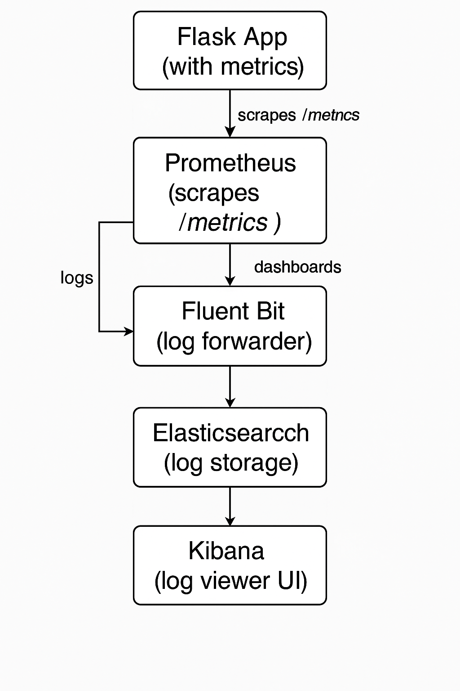

# 🔗 Monitoring & Logging Project

This guide helps you create a **separate DevOps project** for monitoring and logging a Python (Flask) app using:

* Prometheus + Grafana (metrics)
* EFK (Fluent Bit, Elasticsearch, Kibana) for logging

---

# 🔗 Monitoring & Logging Architecture – Explained with Diagram

This section explains how all the components work together to enable real-time monitoring and logging for your Flask app.

---

## 🔗 What Happens Internally?

1. **Flask App**: Your Python app exposes Prometheus metrics via `prometheus_flask_exporter` on port `5000/metrics`.
2. **Prometheus**: Periodically scrapes metrics from the Flask app endpoint.
3. **Grafana**: Connects to Prometheus and visualizes those metrics on dashboards.
4. **Fluent Bit**: Collects logs from the Flask container and sends them to Elasticsearch.
5. **Elasticsearch**: Stores structured log data for search and analysis.
6. **Kibana**: Reads logs from Elasticsearch and provides visualization/search UI.

---

## 🔗 Connections Summary

| Source        | Destination   | Purpose                      |
| ------------- | ------------- | ---------------------------- |
| Flask App     | Prometheus    | Exposes metrics (`/metrics`) |
| Prometheus    | Grafana       | Metric visualization         |
| Flask Logs    | Fluent Bit    | Container log collection     |
| Fluent Bit    | Elasticsearch | Store logs                   |
| Elasticsearch | Kibana        | Visualize/search logs        |

---

## 🔗 Component Roles

* **Flask App**: Generates logs and exposes performance metrics
* **Prometheus**: Pulls metrics from Flask and stores them
* **Grafana**: Queries Prometheus to show metrics in dashboards
* **Fluent Bit**: Acts as the log shipper
* **Elasticsearch**: Indexes and stores log entries
* **Kibana**: Helps you search and visualize logs from Elasticsearch

---

## 🔗 Block Diagram in Markdown

```
+----------------+       +----------------+       +-----------+
|                |       |                |       |           |
|   Flask App    +------>+   Prometheus   +------>+  Grafana  |
| (with metrics) |       | (scrapes /metrics)     | (dashboards)
|                |       |                |       |           |
+----------------+       +----------------+       +-----------+
        |
        | logs
        v
+----------------+
|   Fluent Bit   |
| (log forwarder)|
+--------+-------+
         |
         v
+-------------------+
|   Elasticsearch   |
|  (log storage)    |
+--------+----------+
         |
         v
+-------------------+
|      Kibana       |
|  (log viewer UI)  |
+-------------------+
```

---

<p align="center">
  
</p>

<p align="center">
  
</p>

---

### Flow Breakdown

* **Flask App → Prometheus**: Prometheus scrapes `/metrics` from Flask
* **Prometheus → Grafana**: Grafana reads metrics from Prometheus to generate dashboards
* **Flask App → Fluent Bit**: Application logs are streamed
* **Fluent Bit → Elasticsearch**: Logs are stored and indexed
* **Elasticsearch → Kibana**: Kibana reads and visualizes logs


## 🔗 Prerequisites

* Ubuntu 20.04 or later
* Docker and Docker Compose installed
* Basic Python (Flask) app

---

## 🔗 Project Structure

```
monitoring-logging-project/
├── app/
│   ├── app.py
│   ├── requirements.txt
├── prometheus/
│   └── prometheus.yml
├── docker-compose.yml
└── README.md
```

---

## 🔗 app/app.py

```python
from flask import Flask
from prometheus_flask_exporter import PrometheusMetrics

app = Flask(__name__)
metrics = PrometheusMetrics(app)

@app.route("/")
def home():
    return "Hello from Flask with Prometheus!"

if __name__ == '__main__':
    app.run(host='0.0.0.0', port=5000)
```

---

## 🔗 app/requirements.txt

```
flask
prometheus_flask_exporter
```

---

## 🔗 prometheus/prometheus.yml

```yaml
global:
  scrape_interval: 5s

scrape_configs:
  - job_name: 'flask_app'
    static_configs:
      - targets: ['flask:5000']
```

---

## 🔗 docker-compose.yml

```yaml
version: '3.8'

services:
  flask:
    build: ./app
    container_name: flask
    ports:
      - "5000:5000"

  prometheus:
    image: prom/prometheus
    volumes:
      - ./prometheus/prometheus.yml:/etc/prometheus/prometheus.yml
    ports:
      - "9090:9090"

  grafana:
    image: grafana/grafana
    ports:
      - "3000:3000"

  elasticsearch:
    image: docker.elastic.co/elasticsearch/elasticsearch:7.10.2
    environment:
      - discovery.type=single-node
    ports:
      - "9200:9200"

  kibana:
    image: docker.elastic.co/kibana/kibana:7.10.2
    ports:
      - "5601:5601"

  fluent-bit:
    image: fluent/fluent-bit:latest
    volumes:
      - ./fluent-bit/fluent-bit.conf:/fluent-bit/etc/fluent-bit.conf
    depends_on:
      - elasticsearch
```

---

## 🔗 Run the Project

```bash
docker-compose up --build
```

Visit in browser:

* Flask App: [http://localhost:5000](http://localhost:5000)
* Prometheus: [http://localhost:9090](http://localhost:9090)
* Grafana: [http://localhost:3000](http://localhost:3000)
* Kibana: [http://localhost:5601](http://localhost:5601)

---

## 🔗 Summary

You now have:

* Metrics exposed from your Flask app using Prometheus and Grafana
* Log collection and visualization using Fluent Bit, Elasticsearch, and Kibana

Let me know if you'd like a dashboard JSON for Grafana or Fluent Bit config next!
